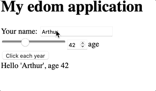

# An immediate mode web frontend library written in Rust.

It builds up VDOM for not having to run too many DOM operations,
but as it runs every time any change is executed, it allows for a simple
programming model without message passing / callbacks / signals, just like EGUI.

The render function is called once for creating the initial web page, and then
twice for each event: 
- once for computing the side effects of the event
- once more for rendering the changes that happened by modifying the state (variables)

# A very simple program to illustrate usage
(in `examples/demo` directory):

```
use edom;
use wasm_bindgen::prelude::wasm_bindgen;

#[wasm_bindgen(start)]
pub fn demo() {
    let mut name = "Arthur".to_string();
    let mut age:f64 = 42.0;
    edom::wasm::render(move |mut root| {
        root.h1().text("My edom application");
        root.div(|div| {
            div.text("Your name: ");
            div.text_input(&mut name);
        });
        root.div(|div| {
            div.range_input(&mut age, 0.0, 120.0);
            div.number_input(&mut age).min(0.0).max(120.0);
            div.text("age");
        });
        if root.button("Click each year").clicked() {
            age+=1.0;
        }
        root.br();
        root.text(format!("Hello '{}', age {}", name, age).as_str());
    });
}
```




